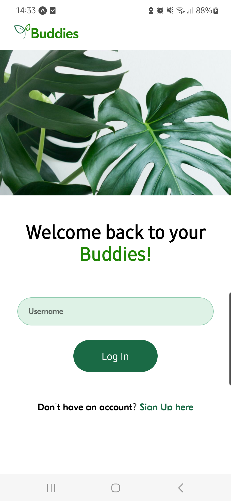
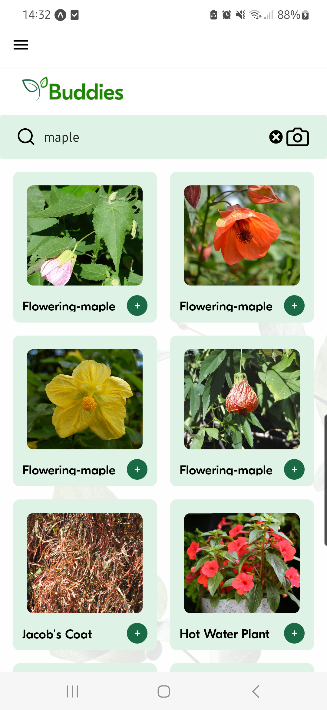
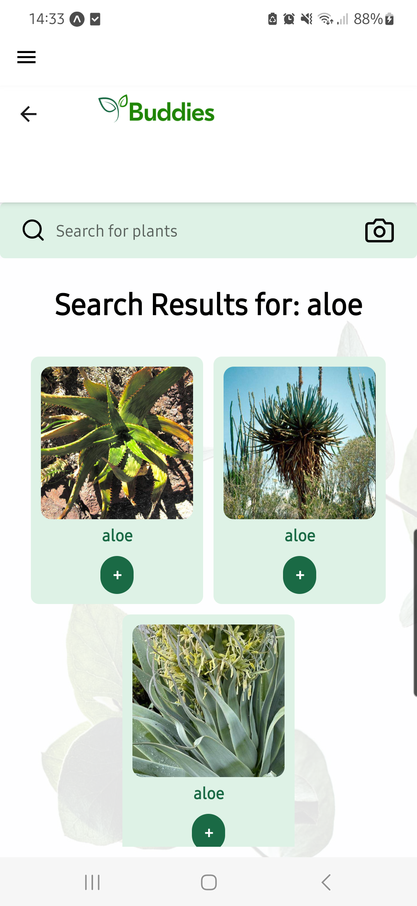
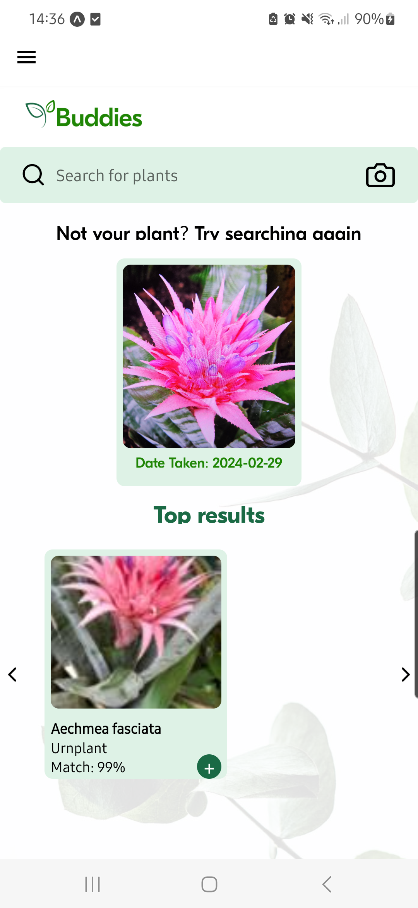
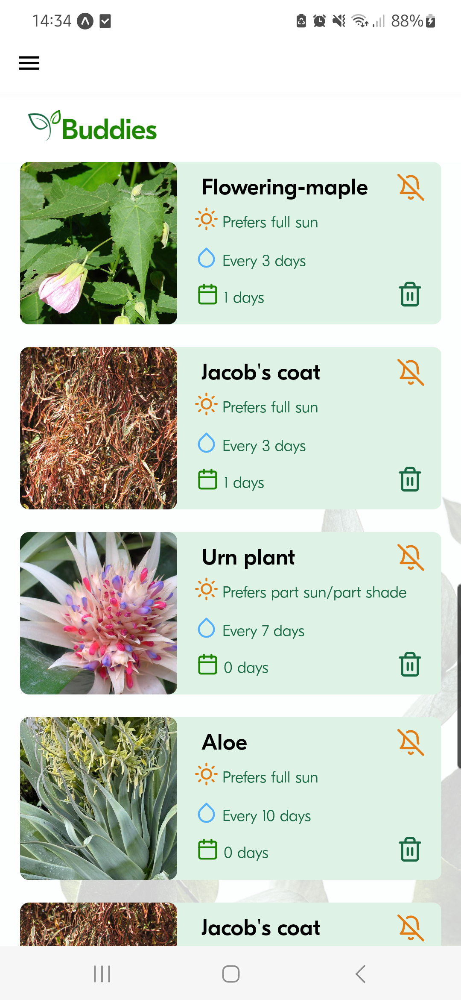

# Buddies

Welcome to our Buddies app!

This plant care app allows users to add plants to their profile, including by taking an image of a plant they would like to identify, and providing plant care information. Users have the option to turn on push notifications for when each plant needs watering, and also has a streak feature for how long each plant has been kept alive.







# Setup

To get started, fork and clone this repo. Then run:

```
npm install
```

You will need to sign-up to Firebase, Perenuals API and Plant.id API to get API keys. These all have free tiers options.

These API keys will need to be added in the api.js, PlantListApi.js and firebaseConfig.js files, where it states '[YOUR-API-KEY]', as well as providing additional firebase details in the firebaseConfig.js file . Once done, run:

```
npm start
```

This will provide a QR code, that can be used to test on iOS using the camera, or on Android by downloading Expo Go. Alternatively, this can be tested on an iOS or Android simulator, however, please note, the functionality has not been built to test the camera in a simulator.

# Built With

- React Native
- Expo, including Expo Camera
- Firebase
- Perenuals API
- Plant.id API

# Authors

- Alexandra Howlett
- Grace Hartley
- Humayra Rashid
- Kar-ho Lee
- Tetiana Chmelova

This project was developed as a final group project in February 2024 on the Northcoders Software Development Bootcamp.
